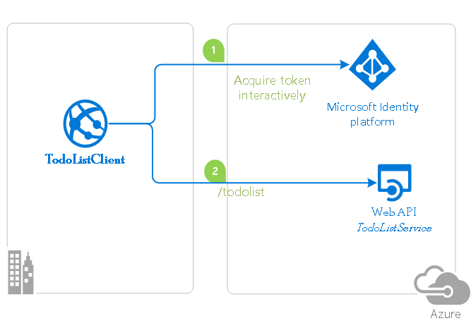

# An Angular Single-page Application (SPA) that Authenticates Users with Azure AD and Calls a Protected ASP.NET Core Web API using Azure AD App Roles

## Overview

This sample demonstrates a cross-platform application suite involving an Angular SPA (*TodoListSPA*) calling an ASP.NET Core Web API (*TodoListAPI*) secured with Azure Active Directory.

### Scenario

- TodoListSPA uses [MSAL.js](https://github.com/AzureAD/microsoft-authentication-library-for-js) and [MSAL-Angular](https://github.com/AzureAD/microsoft-authentication-library-for-js/tree/dev/lib/msal-angular) to authenticate a user.
- The app then obtains an [access token](https://docs.microsoft.com/azure/active-directory/develop/access-tokens) from Azure Active Directory (Azure AD) on behalf of the authenticated user.
- The access token is then used to authorize the call to the TodoListAPI.
- TodoListAPI uses [MSAL.NET](https://github.com/AzureAD/microsoft-authentication-library-for-dotnet) and [Microsoft.Identity.Web](https://github.com/AzureAD/microsoft-identity-web) to protect its endpoint and accept authorized calls.



## Contents

| File/folder       | Description                                |
|-------------------|--------------------------------------------|
| `AppCreationScripts` | Contains Powershell scripts to automate app registrations. |
| `ReadmeFiles`     | Sample readme files.                       |
| `TodoListAPI`     | Source code of the TodoList API.           |
| `TodoListSPA`     | Source code of the TodoList client SPA.    |
| `CHANGELOG.md`    | List of changes to the sample.             |
| `CONTRIBUTING.md` | Guidelines for contributing to the sample. |
| `README.md`       | This README file.                          |
| `LICENSE`         | The license for the sample.                |

## Prerequisites

- [Node.js](https://nodejs.org/en/download/) must be installed to run this sample.
- [Dotnet Core SDK](https://dotnet.microsoft.com/download) must be installed to run this sample.
- An Azure Active Directory (Azure AD) tenant.
- At least **two** user accounts in your Azure AD tenant.
- A modern Browser. This sample uses **ES6** conventions and will not run on **Internet Explorer**.
- We recommend [VS Code](https://code.visualstudio.com/download) for running and debugging this cross-platform application.

## Setup

Using a command line interface such as VS Code integrated terminal, follow the steps below:

### Step 1. Install .NET Core API dependencies

```console
   cd TodoListAPI
   dotnet restore
```

### Step 2. Trust development certificates

```console
   dotnet dev-certs https --clean
   dotnet dev-certs https --trust
```

Learn more about [HTTPS in .NET Core](https://docs.microsoft.com/aspnet/core/security/enforcing-ssl).

### Step 3. Install Angular SPA dependencies

```console
   cd ../
   cd TodoListSPA
   npm install
```

## Registration

There are two projects in this sample. Each needs to be registered separately in your Azure AD tenant. To register these projects, you can:

- either follow the steps below for manual registration,
- or use PowerShell scripts that:
  - **automatically** creates the Azure AD applications and related objects (passwords, permissions, dependencies) for you.
  - modify the configuration files.

<details>
  <summary>Expand this section if you want to use this automation:</summary>

1. On Windows, run PowerShell and navigate to the root of the cloned directory
2. In PowerShell run:

   ```PowerShell
   Set-ExecutionPolicy -ExecutionPolicy RemoteSigned -Scope Process -Force
   ```

3. Run the script to create your Azure AD application and configure the code of the sample application accordingly.
4. In PowerShell run:

   ```PowerShell
   cd .\AppCreationScripts\
   .\Configure.ps1
   ```

   > Other ways of running the scripts are described in [App Creation Scripts](./AppCreationScripts/AppCreationScripts.md)
   > The scripts also provide a guide to automated application registration, configuration and removal which can help in your CI/CD scenarios.

</details>

### Register the service app (TodoListAPI)

1. Navigate to the Microsoft identity platform for developers [App registrations](https://go.microsoft.com/fwlink/?linkid=2083908) page.
1. Select **New registration**.
1. In the **Register an application page** that appears, enter your application's registration information:
   - In the **Name** section, enter a meaningful application name that will be displayed to users of the app, for example `TodoListAPI`.
   - Under **Supported account types**, select **Accounts in this organizational directory**.
1. Select **Register** to create the application.
1. In the app's registration screen, find and note the **Application (client) ID**. You use this value in your app's configuration file(s) later in your code.
1. Select **Save** to save your changes.
1. In the app's registration screen, click on the **Expose an API** blade to the left to open the page where you can declare the parameters to expose this app as an Api for which client applications can obtain [access tokens](https://docs.microsoft.com/azure/active-directory/develop/access-tokens) for.
The first thing that we need to do is to declare the unique [resource](https://docs.microsoft.com/azure/active-directory/develop/v2-oauth2-auth-code-flow) URI that the clients will be using to obtain access tokens for this Api. To declare an resource URI, follow the following steps:
   - Click `Set` next to the **Application ID URI** to generate a URI that is unique for this app.
   - For this sample, accept the proposed Application ID URI (api://{clientId}) by selecting **Save**.
1. All APIs have to publish a minimum of one [scope](https://docs.microsoft.com/azure/active-directory/develop/v2-oauth2-auth-code-flow#request-an-authorization-code) for the client's to obtain an access token successfully. To publish a scope, follow the following steps:
   - Select **Add a scope** button open the **Add a scope** screen and Enter the values as indicated below:
        - For **Scope name**, use `access_as_user`.
        - Select **Admins and users** options for **Who can consent?**
        - For **Admin consent display name** type `Access TodoListAPI`
        - For **Admin consent description** type `Allows the app to access TodoListAPI as the signed-in user.`
        - For **User consent display name** type `Access TodoListAPI`
        - For **User consent description** type `Allow the application to access TodoListAPI on your behalf.`
        - Keep **State** as **Enabled**
        - Click on the **Add scope** button on the bottom to save this scope.

#### Configure the  service app (TodoListAPI) to use your app registration

Open the project in your IDE (like Visual Studio) to configure the code.
> In the steps below, "ClientID" is the same as "Application ID" or "AppId".

1. Open the `TodoListAPI\appsettings.json` file.
1. Find the app key `Domain` and replace the existing value with your Azure AD tenant name.
1. Find the app key `ClientId` and replace the existing value with the application ID (clientId) of the `TodoListAPI` application copied from the Azure portal.
1. Find the app key `TenantId` and replace the existing value with the tenant ID of the `TodoListAPI` application copied from the Azure portal.

### Register the client app (TodoListSPA)

1. Navigate to the Microsoft identity platform for developers [App registrations](https://go.microsoft.com/fwlink/?linkid=2083908) page.
1. Select **New registration**.
1. In the **Register an application page** that appears, enter your application's registration information:
   - In the **Name** section, enter a meaningful application name that will be displayed to users of the app, for example `TodoListSPA`.
   - Under **Supported account types**, select **Accounts in this organizational directory**.
   - In the **Redirect URI** section, select **Single-page application** in the combo-box and enter the following redirect URI: `http://localhost:4200/`.
1. Select **Register** to create the application.
1. In the app's registration screen, find and note the **Application (client) ID**. You use this value in your app's configuration file(s) later in your code.
1. In the app's registration screen, select **Authentication** in the menu.
   - If you don't have a platform added, select **Add a platform** and select the **Single-page application** option.
   - In the **Implicit grant** section, check the **Access tokens** and **ID tokens** option as this sample requires
     the [Implicit grant flow](https://docs.microsoft.com/azure/active-directory/develop/v2-oauth2-implicit-grant-flow) to be enabled to
     sign-in the user, and call an API.

1. Select **Save** to save your changes.
1. In the app's registration screen, click on the **API permissions** blade in the left to open the page where we add access to the Apis that your application needs.
   - Click the **Add a permission** button and then,
   - Ensure that the **My APIs** tab is selected.
   - In the list of APIs, select the API `TodoListAPI`.
   - In the **Delegated permissions** section, select the **access_as_user** in the list. Use the search box if necessary.
   - Click on the **Add permissions** button at the bottom.

#### Configure the client app (TodoListSPA) to use your app registration

Open the project in your IDE (like Visual Studio) to configure the code.
>In the steps below, "ClientID" is the same as "Application ID" or "AppId".

1. Open the `TodoListSPA\src\app\app-config.json` file
1. Find the app key `clientId` and replace the existing value with the application ID (clientId) of the `TodoListSPA` application copied from the Azure portal.
1. Find the app key `webApi.resourceUri` and replace the existing value with the base address of the TodoListAPI project (by default `https://localhost:44351/api/todolist`).
1. Find the app key `webApi.resourceScope` and replace the existing value with *Scope* you created earlier `api://{clientId}/access_as_user`.

## Define Application Roles

1. In the blade for your application on Azure Portal, click **Manifest**.
1. Edit the manifest by locating the `appRoles` setting and adding the two Application Roles.  The role definitions are provided in the JSON code block below.  Leave the `allowedMemberTypes` to **User** only.  Each role definition in this manifest must have a different valid **Guid** for the "id" property. Note that the `"value"` property of each role is set to the exact strings **TenantAdmin** and **TenantUser** (as these strings are used in the code in the application).
1. Save the manifest.

The content of `appRoles` should be the following (the `id` should be a unique Guid -you may use a GUID Generator tool for this)

```json
   "appRoles": [
      {
         "allowedMemberTypes": [
            "User"
         ],
         "description": "Admins can read others' todolists",
         "displayName": "TenantAdmin",
         "id": "72ff9f52-8011-49e0-a4f4-cc1bb26206fa",
         "isEnabled": true,
         "lang": null,
         "origin": "Application",
         "value": "TenantAdmin"
      },
      {
         "allowedMemberTypes": [
            "User"
         ],
         "description": "Users can read and modify their todolist",
         "displayName": "TenantUser",
         "id": "a816142a-2e8e-46c4-9997-f984faccb625",
         "isEnabled": true,
         "lang": null,
         "origin": "Application",
         "value": "TenantUser"
      }
   ],
```

> Note:  To receive the `roles` claim in Id and Access tokens with the name of the app roles this user is assigned to, make sure that the user accounts you plan to sign-in to this app is assigned to the app roles of this app. The guide, [Assign a user or group to an enterprise app in Azure Active Directory](https://docs.microsoft.com/azure/active-directory/manage-apps/assign-user-or-group-access-portal#assign-a-user-to-an-app---portal) provides step by step instructions.

## Run the sample

Using a command line interface such as VS Code integrated terminal, locate the application directory. Then:  

```console
   cd ../
   cd TodoListSPA
   npm start
```

In a separate console window, execute the following commands

```console
   cd TodoListAPI
   dotnet run
```

## Explore the sample

1. Open your browser and navigate to `http://localhost:4200`.
2. Sign-in using the button on top-right:


1. Click on the **Get My Tasks** button to access your (the signed-in user's) todo list:


1. If the signed-in user has the right privileges (i.e. in the right "role"), click on the **See All Tasks** button to access every users' todo list:


1. If the signed-in user does not have the right privileges, clicking on the **See All Tasks** will give an error:


## Discussion

### Angular RoleGuard and Protected Routes for Role-Based Access Control

Our client application, TodoListSPA, has a **RoleGuard** (`role-guard.service.ts`) component that checks whether a user has the right privileges to access a protected route. It does this by checking `roles` claim the ID token of the signed-in user:

```typescript
export class RoleGuardService implements CanActivate {

  constructor(private authService: MsalService, private router: Router) {}
  
  canActivate(route: ActivatedRouteSnapshot): boolean {
    const expectedRole = route.data.expectedRole;

    if (!this.authService.getAccount().idTokenClaims.roles.includes(expectedRole)) {
        window.alert('You do not have access for this');
        return false;
    }

    return true;
  }
}
```

We then enable **RoleGuard** in `app-routing.module.ts` as follows:

```typescript
const routes: Routes = [
  {
    path: 'todo-edit/:id',
    component: TodoEditComponent,
    canActivate: [
      MsalGuard
    ]
  },
  {
    path: 'todo-view',
    component: TodoViewComponent,
    canActivate: [
      MsalGuard
    ]
  },
  {
    path: 'dashboard',
    component: DashboardComponent,
    canActivate: [
      MsalGuard,
      RoleGuardService,
    ],
    data: {
      expectedRole: 'TenantAdmin'
    }
  }
];
```

However, it is important to be aware of that no content on the front-end application can be **truly** secure. That is, our **RoleGuard** component is primarily responsible for rendering the correct UI elements for a user in a particular role; in the example above, we allow only users in the `TenantAdmin` role to see the `Dashboard` component. In order to **truly** protect data and expose REST operations to a selected set of users, we need to enable **RBAC** on the back-end as well.

### Policy based Authorization for .NET Core Web API

As mentioned before, in order to **truly** implement RBAC and secure data, we need to allow only authorized calls to our web API. We do this by defining access policies and decorating our REST methods with them. To do so, we first add `roles` claim as a validation parameter in `Startup.cs`, and then create authorization policies that depends on this claim: 

```csharp
   // The following lines code instruct the asp.net core middleware to use the data in the "roles" claim in the Authorize attribute and User.IsInrole()
   // See https://docs.microsoft.com/aspnet/core/security/authorization/roles?view=aspnetcore-2.2 for more info.
   services.Configure<JwtBearerOptions>(JwtBearerDefaults.AuthenticationScheme, options =>
   {
         // The claim in the Jwt token where App roles are available.
         options.TokenValidationParameters.RoleClaimType = "http://schemas.microsoft.com/ws/2008/06/identity/claims/role"; // this schema stands for "roles"
   });

         // Adding authorization policies that enforce authorization using Azure AD roles.
   services.AddAuthorization(options =>
   {
         options.AddPolicy(AuthorizationPolicies.AssignmentToTenantUserRoleRequired, policy => policy.RequireRole(AppRole.TenantUser));
         options.AddPolicy(AuthorizationPolicies.AssignmentToTenantAdminRoleRequired, policy => policy.RequireRole(AppRole.TenantAdmin));
   });
```

We defined these roles in `AppRoles.cs` as follows:

```csharp
   public static class AppRole
   {
      public const string TenantUser = "TenantUser";
      public const string TenantAdmin = "TenantAdmin";
   }
   public static class AuthorizationPolicies
   {
      public const string AssignmentToTenantUserRoleRequired = "AssignmentToTenantUserRoleRequired";
      public const string AssignmentToTenantAdminRoleRequired = "AssignmentToTenantAdminRoleRequired";
   }
```

Finally, in `TodoListController.cs`, we decorate our routes with the appropriate policy:

```csharp
   // GET: api/todolist/getAll
   [HttpGet]
   [Route("getAll")]
   [Authorize(Policy = AuthorizationPolicies.AssignmentToTenantAdminRoleRequired)]
   public async Task<ActionResult<IEnumerable<TodoItem>>> GetAll()
   {
      HttpContext.VerifyUserHasAnyAcceptedScope(scopeRequiredByApi);
      return await _context.TodoItems.ToListAsync();
   }

   // GET: api/todolist
   [HttpGet]
   [Authorize(Policy = AuthorizationPolicies.AssignmentToTenantUserRoleRequired)]
   public async Task<ActionResult<IEnumerable<TodoItem>>> GetTodoItems()
   {
      HttpContext.VerifyUserHasAnyAcceptedScope(scopeRequiredByApi);
      string owner = User.FindFirst("preferred_username")?.Value;
      return await _context.TodoItems.Where(item => item.Owner == owner).ToListAsync();
   }
```

> [!NOTE]
> Did the sample not work for you as expected? Did you encounter issues trying this sample? Then please reach out to us using the [GitHub Issues](../issues) page.

## Debugging the sample

To debug the .NET Core Web API that comes with this sample, install the [C# extension](https://marketplace.visualstudio.com/items?itemName=ms-dotnettools.csharp) for Visual Studio Code.

Learn more about using [.NET Core with Visual Studio Code](https://docs.microsoft.com/dotnet/core/tutorials/with-visual-studio-code).

## Contributing

This project welcomes contributions and suggestions.  Most contributions require you to agree to a
Contributor License Agreement (CLA) declaring that you have the right to, and actually do, grant us
the rights to use your contribution. For details, visit https://cla.opensource.microsoft.com.

When you submit a pull request, a CLA bot will automatically determine whether you need to provide
a CLA and decorate the PR appropriately (e.g., status check, comment). Simply follow the instructions
provided by the bot. You will only need to do this once across all repos using our CLA.

## Code of Conduct

This project has adopted the [Microsoft Open Source Code of Conduct](https://opensource.microsoft.com/codeofconduct/).
For more information see the [Code of Conduct FAQ](https://opensource.microsoft.com/codeofconduct/faq/) or
contact [opencode@microsoft.com](mailto:opencode@microsoft.com) with any additional questions or comments.
