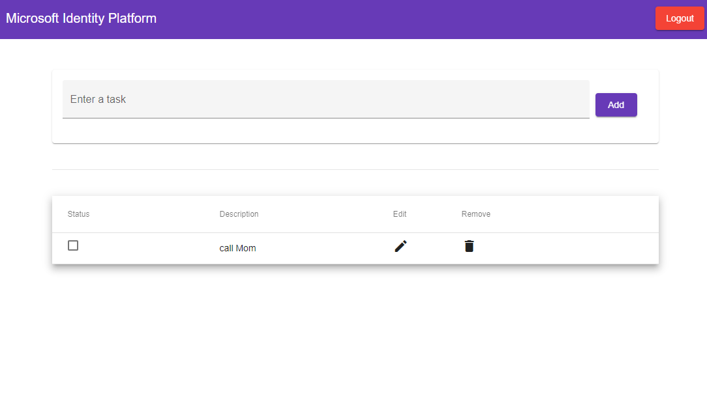

# An Angular Single-page Application (SPA) using AAD Security Groups to implement authorization

## Overview

This sample demonstrates a cross-platform application suite involving an Angular SPA (*TodoListSPA*) calling an ASP.NET Core Web API (*TodoListAPI*) secured with Azure Active Directory. It also implements authorization for a **role-based access control** by using Azure AD Security Groups.

In the sample, a dashboard component allows signed-in users to see the tasks assigned to them or other users based on their memberships to one of the two security groups, **GroupAdmin** and **GroupMember**.

Authorization in Azure AD can also be done with `App Roles` as well, as shown in [chapter1](../chapter1\README.md). `Groups` and `App Roles` in Azure AD are by no means mutually exclusive - they can be used in tandem to provide even finer grained access control.

### Scenario

- TodoListSPA uses [MSAL.js](https://github.com/AzureAD/microsoft-authentication-library-for-js) and [MSAL-Angular](https://github.com/AzureAD/microsoft-authentication-library-for-js/tree/dev/lib/msal-angular) to authenticate a user with the Microsoft Identity Platform.
- The app then obtains an [access token](https://docs.microsoft.com/azure/active-directory/develop/access-tokens) from Azure Active Directory (Azure AD) on behalf of the authenticated user for the **TodoListAPI**.
- The access token is then used by the **TodoListAPI** to authorize the user.
- **TodoListAPI** uses [MSAL.NET](https://github.com/AzureAD/microsoft-authentication-library-for-dotnet) and [Microsoft.Identity.Web](https://github.com/AzureAD/microsoft-identity-web) to protect its endpoint and accept authorized calls.


## Contents

| File/folder       | Description                                |
|-------------------|--------------------------------------------|
| `AppCreationScripts` | Contains Powershell scripts to automate app registrations. |
| `TodoListAPI`     | Source code of the TodoList API.           |
| `TodoListSPA`     | Source code of the TodoList client SPA.    |
| `CHANGELOG.md`    | List of changes to the sample.             |
| `CONTRIBUTING.md` | Guidelines for contributing to the sample. |
| `LICENSE`         | The license for the sample.                |

## Prerequisites

- [Node.js](https://nodejs.org/en/download/) must be installed to run this sample.
- [Dotnet Core SDK](https://dotnet.microsoft.com/download) must be installed to run this sample.
- An Azure Active Directory (Azure AD) tenant.
- At least **two** user accounts in your Azure AD tenant.
- A modern Browser. This sample uses **ES6** conventions and will not run on **Internet Explorer**.
- Two security groups **GroupAdmin** and **GroupMember**, with users you want to test with assigned to them.
- We recommend [VS Code](https://code.visualstudio.com/download) for running and debugging this cross-platform application.

## Setup

Using a command line interface such as VS Code integrated terminal, follow the steps below:

### Step 1. Install .NET Core API dependencies

```console
   cd TodoListAPI
   dotnet restore
```

### Step 2. Trust development certificates

```console
   dotnet dev-certs https --clean
   dotnet dev-certs https --trust
```

Learn more about [HTTPS in .NET Core](https://docs.microsoft.com/aspnet/core/security/enforcing-ssl).

### Step 3. Install Angular SPA dependencies

```console
   cd ../
   cd TodoListSPA
   npm install
```

## Registration

There are two projects in this sample. Each needs to be registered separately in your Azure AD tenant. To register these projects, you can:

- either follow the steps below for manual registration,
- or use PowerShell scripts that:
  - **automatically** creates the Azure AD applications and related objects (passwords, permissions, dependencies) for you.
  - modify the configuration files.

<details>
  <summary>Expand this section if you want to use this automation:</summary>

1. On Windows, run PowerShell as **Administrator** and navigate to the root of the cloned directory
1. In PowerShell run:

   ```PowerShell
   Set-ExecutionPolicy -ExecutionPolicy RemoteSigned -Scope Process -Force
   ```

1. Run the script to create your Azure AD application and configure the code of the sample application accordingly.
1. In PowerShell run:

   ```PowerShell
   cd .\AppCreationScripts\
   .\Configure.ps1
   ```

   > Other ways of running the scripts are described in [App Creation Scripts](./AppCreationScripts/AppCreationScripts.md)
   > The scripts also provide a guide to automated application registration, configuration and removal which can help in your CI/CD scenarios.

</details>

### Register the service app (TodoListAPI)

1. Navigate to the [Azure portal](https://portal.azure.com) and select the **Azure AD** service.
1. Select the **App registrations** blade on the left, then select **New registration**.
1. In the **Register an application page** that appears, enter your application's registration information:
   - In the **Name** section, enter a meaningful application name that will be displayed to users of the app, for example `TodoListAPI`.
   - Under **Supported account types**, select **Accounts in this organizational directory only**.
1. Select **Register** to create the application.
1. In the app's registration screen, find and note the **Application (client) ID**. You use this value in your app's configuration file(s) later in your code.
1. Select **Save** to save your changes.
1. In the app's registration screen, click on the **Certificates & secrets** blade in the left to open the page where we can generate secrets and upload certificates.
1. In the **Client secrets** section, click on **New client secret**:
   - Type a key description (for instance `app secret`),
   - Select one of the available key durations (**In 1 year**, **In 2 years**, or **Never Expires**) as per your security posture.
   - The generated key value will be displayed when you click the **Add** button. Copy the generated value for use in the steps later.
   - You'll need this key later in your code's configuration files. This key value will not be displayed again, and is not retrievable by any other means, so make sure to note it from the Azure portal before navigating to any other screen or blade.
1. In the app's registration screen, click on the **API permissions** blade in the left to open the page where we add access to the APIs that your application needs.
   - Click the **Add a permission** button and then,
   - Ensure that the **Microsoft APIs** tab is selected.
   - In the *Commonly used Microsoft APIs* section, click on **Microsoft Graph**
   - In the **Delegated permissions** section, select the **User.Read**, **GroupMember.Read.All** in the list. Use the search box if necessary.
   - Click on the **Add permissions** button at the bottom.
   - **GroupMember.Read.All** requires admin to consent. Click the **Grant/revoke admin consent for {tenant}** button, and then select **Yes** when you are asked if you want to grant consent for the requested permissions for all account in the tenant. You need to be an Azure AD tenant admin to do this.
1. In the app's registration screen, select the **Expose an API** blade to the left to open the page where you can declare the parameters to expose this app as an API for which client applications can obtain [access tokens](https://docs.microsoft.com/azure/active-directory/develop/access-tokens) for.
The first thing that we need to do is to declare the unique [resource](https://docs.microsoft.com/azure/active-directory/develop/v2-oauth2-auth-code-flow) URI that the clients will be using to obtain access tokens for this API. To declare an resource URI, follow the following steps:
   - Click `Set` next to the **Application ID URI** to generate a URI that is unique for this app.
   - For this sample, accept the proposed Application ID URI (api://{clientId}) by selecting **Save**.
1. All APIs have to publish a minimum of one [scope](https://docs.microsoft.com/azure/active-directory/develop/v2-oauth2-auth-code-flow#request-an-authorization-code) for the client's to obtain an access token successfully. To publish a scope, follow the following steps:
   - Select **Add a scope** button open the **Add a scope** screen and Enter the values as indicated below:
        - For **Scope name**, use `access_as_user`.
        - Select **Admins and users** options for **Who can consent?**
        - For **Admin consent display name** type `Access TodoListAPI`
        - For **Admin consent description** type `Allows the app to access TodoListAPI as the signed-in user.`
        - For **User consent display name** type `Access TodoListAPI`
        - For **User consent description** type `Allow the application to access TodoListAPI on your behalf.`
        - Keep **State** as **Enabled**
        - Click on the **Add scope** button on the bottom to save this scope.

#### Configure the service app (TodoListAPI) to use your app registration

Open the project in your IDE (like Visual Studio or Visual Studio Code) to configure the code.

> In the steps below, "ClientID" is the same as "Application ID" or "AppId".

1. Open the `TodoListAPI\appsettings.json` file.
1. Find the app key `Domain` and replace the existing value with your Azure AD tenant name.
1. Find the app key `ClientId` and replace the existing value with the application ID (clientId) of the `TodoListAPI` application copied from the Azure portal.
1. Find the app key `TenantId` and replace the existing value with your Azure AD tenant ID.
1. Find the app key `ClientSecret` and replace the existing value with the key you saved during the creation of the `TodoListAPI` app, in the Azure portal.

### Register the client app (TodoListSPA)

1. Navigate to the [Azure portal](https://portal.azure.com) and select the **Azure AD** service.
1. Select the **App registrations** blade on the left, then select **New registration**.
1. In the **Register an application page** that appears, enter your application's registration information:
   - In the **Name** section, enter a meaningful application name that will be displayed to users of the app, for example `TodoListSPA`.
   - Under **Supported account types**, select **Accounts in this organizational directory only**.
   - In the **Redirect URI (optional)** section, select **Single-Page Application** in the combo-box and enter the following redirect URI: `http://localhost:4200/`.
1. Select **Register** to create the application.
1. In the app's registration screen, find and note the **Application (client) ID**. You use this value in your app's configuration file(s) later in your code.
1. In the app's registration screen, select **Authentication** in the menu.
   - If you don't have a platform added, select **Add a platform** and select the **Single-Page Application** option.
   - In the **Implicit grant** section, check the **Access tokens** and **ID tokens** option as this sample requires
     the the [Implicit grant flow](https://docs.microsoft.com/azure/active-directory/develop/v2-oauth2-implicit-grant-flow) to be enabled to sign-in the user and call an API.
1. Select **Save** to save your changes.
1. In the app's registration screen, click on the **API permissions** blade in the left to open the page where we add access to the APIs that your application needs.
   - Click the **Add a permission** button and then:
   - Ensure that the **My APIs** tab is selected.
   - In the list of APIs, select the API `TodoListAPI`.
   - In the **Delegated permissions** section, select the **Access 'TodoListAPI'** in the list. Use the search box if necessary.
   - Click on the **Add permissions** button at the bottom.
   - Click the **Add a permission** button and then:
   - Ensure that the **Microsoft APIs** tab is selected.
   - In the *Commonly used Microsoft APIs* section, click on **Microsoft Graph**
   - In the **Delegated permissions** section, select the **User.Read**, **GroupMember.Read.All** in the list. Use the search box if necessary.
   - Click on the **Add permissions** button at the bottom.
   - **GroupMember.Read.All** requires admin to consent. Click the **Grant/revoke admin consent for {tenant}** button, and then select **Yes** when you are asked if you want to grant consent for the requested permissions for all account in the tenant. You need to be an Azure AD tenant admin to do this.

#### Configure the client app (TodoListSPA) to use your app registration

Open the project in your IDE (like Visual Studio or Visual Studio Code) to configure the code.

> In the steps below, "ClientID" is the same as "Application ID" or "AppId".

1. Open the `TodoListSPA\src\app\app-config.json` file.
1. Find the app key `clientId` and replace the existing value with the application ID (clientId) of the `TodoListSPA` application copied from the Azure portal.
1. Find the app key `webApi.resourceUri` and replace the existing value with the base address of the TodoListAPI project (by default `https://localhost:44351/api/todolist`).
1. Find the app key `webApi.resourceScope` and replace the existing value with *Scope* you created earlier `api://{clientId}/access_as_user`.

## Configure your application to receive the **groups** claim

> :warning: The **Token Configuration** steps below that you need to perform are the same for both **TodoListAPI** and **TodoListSPA**.

Now you have two different options available to you on how you can further configure your application to receive the `groups` claim.

1. [Receive **all the groups** that the signed-in user is assigned to in an Azure AD tenant, included nested groups](#configure-your-application-to-receive-all-the-groups-the-signed-in-user-is-assigned-to-including-nested-groups).
2. [Receive the **groups** claim values from a **filtered set of groups** that your application is programmed to work with](#configure-your-application-to-receive-the-groups-claim-values-from-a-filtered-set-of-groups-a-user-may-be-assigned-to) (Not available in the [Azure AD Free edition](https://azure.microsoft.com/pricing/details/active-directory/)).

> To get the on-premise group's `samAccountName` or `On Premises Group Security Identifier` instead of Group ID, please refer to the document [Configure group claims for applications with Azure Active Directory](https://docs.microsoft.com/azure/active-directory/hybrid/how-to-connect-fed-group-claims#prerequisites-for-using-group-attributes-synchronized-from-active-directory).

### Configure your application to receive **all the groups** the signed-in user is assigned to, including nested groups

1. In the app's registration screen, click on the **Token Configuration** blade in the left to open the page where you can configure the claims provided tokens issued to your application.
1. Click on the **Add groups claim** button on top to open the **Edit Groups Claim** screen.
1. Select `Security groups` **or** the `All groups (includes distribution lists but not groups assigned to the application)` option. Choosing both negates the effect of `Security Groups` option.
1. Under the **ID** section, select `Group ID`. This will result in Azure AD sending the [object id](https://docs.microsoft.com/graph/api/resources/group?view=graph-rest-1.0) of the groups the user is assigned to in the **groups** claim of the [ID Token](https://docs.microsoft.com/azure/active-directory/develop/id-tokens) that your app receives after signing-in a user.

### Configure your application to receive the `groups` claim values from a **filtered set of groups** a user may be assigned to

#### Prerequisites, benefits and limitations of using this option

1. This option is useful when your application is interested in a selected set of groups that a signing-in user may be assigned to and not every security group this user is assigned to in the tenant.  This option also saves your application from running into the [overage](#groups-overage-claim) issue.
1. This feature is not available in the [Azure AD Free edition](https://azure.microsoft.com/pricing/details/active-directory/).
1. **Nested group assignments** are not available when this option is utilized.

#### Steps to enable this option in your app

1. In the app's registration screen, click on the **Token Configuration** blade in the left to open the page where you can configure the claims provided tokens issued to your application.
1. Click on the **Add groups claim** button on top to open the **Edit Groups Claim** screen.
1. Select `Groups assigned to the application`.
    1. Choosing additional options like `Security Groups` or `All groups (includes distribution lists but not groups assigned to the application)` will negate the benefits your app derives from choosing to use this option.
1. Under the **ID** section, select `Group ID`. This will result in Azure AD sending the object [id](https://docs.microsoft.com/graph/api/resources/group?view=graph-rest-1.0) of the groups the user is assigned to in the `groups` claim of the [ID Token](https://docs.microsoft.com/azure/active-directory/develop/id-tokens) that your app receives after signing-in a user.
1. If you are exposing a Web API using the **Expose an API** option, then you can also choose the `Group ID` option under the **Access** section. This will result in Azure AD sending the [Object ID](https://docs.microsoft.com/graph/api/resources/group?view=graph-rest-1.0) of the groups the user is assigned to in the `groups` claim of the [Access Token](https://docs.microsoft.com/azure/active-directory/develop/access-tokens) issued to the client applications of your API.
1. In the app's registration screen, click on the **Overview** blade in the left to open the Application overview screen. Select the hyperlink with the name of your application in **Managed application in local directory** (note this field title can be truncated for instance `Managed application in ...`). When you select this link you will navigate to the **Enterprise Application Overview** page associated with the service principal for your application in the tenant where you created it. You can navigate back to the app registration page by using the *back* button of your browser.
1. Select the **Users and groups** blade in the left to open the page where you can assign users and groups to your application.
    1. Click on the **Add user** button on the top row.
    1. Select **User and Groups** from the resultant screen.
    1. Choose the groups that you want to assign to this application.
    1. Click **Select** in the bottom to finish selecting the groups.
    1. Click **Assign** to finish the group assignment process.  
    1. Your application will now receive these selected groups in the `groups` claim when a user signing in to your app is a member of  one or more these **assigned** groups.
1. Select the **Properties** blade in the left to open the page that lists the basic properties of your application.Set the **User assignment required?** flag to **Yes**.

> :bulb: **Important security tip**
>
> When you set **User assignment required?** to **Yes**, Azure AD will check that only users assigned to your application in the **Users and groups** blade are able to sign-in to your app. You can assign users directly or by assigning security groups they belong to.

### Configure the client app (TodoListSPA) to recognize Group IDs

> :warning:
> During **Token Configuration**, if you have chosen any other option except **groupID** (e.g. like **DNSDomain\sAMAccountName**) you should enter the **group name** (for example `contoso.com\Test Group`) instead of the **object ID** below:

1. Open the `TodoListSPA\src\app\app-config.json` file.
1. Find the app key `groups.groupAdmin` and replace the existing value with the **object ID** of the **GroupAdmin** group copied from the Azure portal.
1. Find the app key `groups.groupMember` and replace the existing value with the **object ID** of the **GroupMember** group copied from the Azure portal.

### Configure the service app (TodoListAPI) to recognize Group IDs

> :warning:
> During **Token Configuration**, if you have chosen any other option except **groupID** (e.g. like **DNSDomain\sAMAccountName**) you should enter the **group name** (for example `contoso.com\Test Group`) instead of the **object ID** below:

1. Open the `TodoListAPI\appsettings.json` file.
2. Find the app key `Groups.GroupAdmin` and replace the existing value with the object ID of the **GroupAdmin** group copied from the Azure portal.
3. Find the app key `Groups.GroupMember` and replace the existing value with the object ID of the **GroupMember** group copied from the Azure portal.

## Run the sample

Using a command line interface such as VS Code integrated terminal, locate the application directory. Then:  

```console
   cd ../
   cd TodoListSPA
   npm start
```

In a separate console window, execute the following commands:

```console
   cd TodoListAPI
   dotnet run
```

## Explore the sample

1. Open your browser and navigate to `http://localhost:4200`.
2. Sign-in using the button on top-right:


1. Click on the **Get My Tasks** button to access your (the signed-in user's) todo list:



1. If the signed-in user has the right privileges (i.e. in the right "group"), click on the **See All Tasks** button to access every users' todo list:


1. If the signed-in user does not have the right privileges, clicking on the **See All Tasks** will give an error:


## About the Code

Much of the specifics of implementing **RBAC** with **Security Groups** is the same with implementing **RBAC** with **App Roles** discussed in [Chapter1](../Chapter1/). In order to avoid redundancy, here we discuss particular issues that might arise with using **groups** claim.

### The Groups Overage Claim

To ensure that the token size doesn’t exceed HTTP header size limits, the Microsoft Identity Platform limits the number of object Ids that it includes in the **groups** claim.

If a user is member of more groups than the overage limit (**150 for SAML tokens, 200 for JWT tokens, 6 for Single Page applications**), then the Microsoft Identity Platform does not emit the group IDs in the `groups` claim in the token. Instead, it includes an **overage** claim in the token that indicates to the application to query the [MS Graph API](https://graph.microsoft.com) to retrieve the user’s group membership.

> We strongly advise you use the [group filtering feature](#configure-your-application-to-receive-the-groups-claim-values-from-a-filtered-set-of-groups-a-user-may-be-assigned-to) (if possible) to avoid running into group overages.

#### Create the Overage Scenario for testing

1. You can use the `BulkCreateGroups.ps1` provided in the [App Creation Scripts](./AppCreationScripts/) folder to create a large number of groups and assign users to them. This will help test overage scenarios during development. Remember to change the user's **objectId** provided in the `BulkCreateGroups.ps1` script.

#### Single-page Applications and how to handle the Overage Scenario

When authenticating using the [Implicit Grant Flow](https://docs.microsoft.com/azure/active-directory/develop/v1-oauth2-implicit-grant-flow), the **overage** indication and limits are different than the apps using other flows.

1. A claim named `hasgroups` with a value of true will be present in the token instead of the `groups` claim.
1. The maximum number of groups provided in the `groups` claim is limited to 6. This is done to prevent the URI fragment beyond the URL length limits.

When attending to overage scenarios, which requires a call to [Microsoft Graph](https://graph.microsoft.com) to read the signed-in user's group memberships, your app will need to have the [User.Read](https://docs.microsoft.com/graph/permissions-reference#user-permissions) and [GroupMember.Read.All](https://docs.microsoft.com/graph/permissions-reference#group-permissions) for the [getMemberGroups](https://docs.microsoft.com/graph/api/user-getmembergroups) function to execute successfully.

> Developers who wish to gain good familiarity of programming for Microsoft Graph are advised to go through the [An introduction to Microsoft Graph for developers](https://www.youtube.com/watch?v=EBbnpFdB92A) recorded session.

We will now discuss how this scenario is handled in the sample.

> :warning: For the overage scenario, make sure you have granted **Admin Consent** for the MS Graph API's **GroupMember.Read.All** scope for both the Client and the Service apps (see the **App Registration** steps above).

##### Angular *group-guard* service

Consider the `group-guard.service.ts`. Here, we are checking whether the token for the user has the "hasgroups" claims, which indicates that the user has too many group memberships. If so, we redirect the user to the `/overage` page. Then, we initiate a call to MS Graph API `https://graph.microsoft.com/v1.0/me/memberOf` endpoint to query the full list of groups that the user belong to. Finally we check for the designated groupID among this list.

```javascript
    // src/app/services/group-guard.service.ts
    canActivate(route: ActivatedRouteSnapshot): boolean {
    this.service.user.displayName = this.authService.getAccount().idTokenClaims.preferred_username;

    if (this.authService.getAccount().idTokenClaims.groups) {
      this.service.user.groupIDs = <string[]><unknown>this.authService.getAccount().idTokenClaims.groups;
    }

    const expectedGroup = route.data.expectedGroup;

    if (this.service.user.groupIDs.length === 0) {
      if (this.authService.getAccount().idTokenClaims.hasgroups) {
        window.alert('You have too many group memberships. The application will now query Microsoft Graph to get the full list of groups that you are a member of.');
        this.router.navigate(['/overage']);
        return false;
      }
      window.alert('Token does not have groups claim');
      return false;
    } else if (!this.service.user.groupIDs.includes(expectedGroup)) {
      window.alert('You do not have access for this');
      return false;
    }
    return true;
  }
```

```javascript
// src/app/components/overage.component.ts
ngOnInit(): void {
    this.handleResponse();
  }

  handleResponse(): void {
    this.service.getGroups().subscribe((response: any) => {
        response.value.map(v => this.groups.push(v.id));

        /**
         * Some queries against Microsoft Graph return multiple pages of data either due to server-side paging
         * or due to the use of the $top query parameter to specifically limit the page size in a request.
         * When a result set spans multiple pages, Microsoft Graph returns an @odata.nextLink property in
         * the response that contains a URL to the next page of results.
         * learn more at https://docs.microsoft.com/graph/paging
         */
        if (response['@odata.nextLink']) {
          this.handleNextPage(response['@odata.nextLink'])
        } else {
          if (this.groups.includes(config.groups.groupAdmin)) {
            this.service.user.groupIDs.push(config.groups.groupAdmin)
          }

          if (this.groups.includes(config.groups.groupMember)) {
            this.service.user.groupIDs.push(config.groups.groupMember)
          }
        }
    })
  }
```

#### .NET Core Web API and how to handle the Overage Scenario

1. In `Startup.cs`, `OnTokenValidated` event calls **GetSignedInUsersGroups** method defined in GraphHelper.cs to process groups overage claim.

    ```csharp
    services.AddAuthentication(JwtBearerDefaults.AuthenticationScheme)
                .AddMicrosoftIdentityWebApi(options =>
        {
            Configuration.Bind("AzureAd", options);
            options.Events = new JwtBearerEvents();
            options.Events.OnTokenValidated = async context =>
            {
                if (context != null)
                {
                //Calls method to process groups overage claim.
                await GraphHelper.GetSignedInUsersGroups(context);
                }
            };
        }, options => { Configuration.Bind("AzureAd", options); })
                .EnableTokenAcquisitionToCallDownstreamApi(options => Configuration.Bind("AzureAd", options))
                .AddMicrosoftGraph(Configuration.GetSection("GraphBeta"))
            .AddInMemoryTokenCaches();
    ```

    `AddMicrosoftGraph` registers the service for `GraphServiceClient`. The values for BaseUrl and Scopes defined in `GraphAPI` section of **appsettings.json**.

1. In GraphHelper.cs, **GetSignedInUsersGroups** method checks if incoming token contains *Group Overage* claim then it will call **ProcessUserGroupsForOverage** method to retrieve groups.

    ```csharp
            public static async Task GetSignedInUsersGroups(TokenValidatedContext context)
            {
                // Checks if the incoming token contained a 'Group Overage' claim.
                if (HasOverageOccurred(context.Principal))
                {
                    await ProcessUserGroupsForOverage(context);
                }
            }
    ```

    **ProcessClaimsForGroupsOverage** method uses `GraphServiceClient` to retrieve groups for the signed-in user from [/me/memberOf](https://docs.microsoft.com/graph/api/user-list-memberof) endpoint. All the group ids are stored in Session.

    ```csharp
                private static async Task ProcessUserGroupsForOverage(TokenValidatedContext context)
                {
                      ...
                        var graphClient = context.HttpContext.RequestServices.GetService<GraphServiceClient>();
                        if (graphClient == null)
                        {
                            Console.WriteLine("No service for type 'Microsoft.Graph.GraphServiceClient' has been registered in the Startup.");
                        }
                        else if (context.SecurityToken != null)
                        {
                            if (!context.HttpContext.Items.ContainsKey("JwtSecurityTokenUsedToCallWebAPI"))
                            {
                                context.HttpContext.Items.Add("JwtSecurityTokenUsedToCallWebAPI", context.SecurityToken as JwtSecurityToken);
                            }
                            string select = "id,displayName,onPremisesNetBiosName,onPremisesDomainName,onPremisesSamAccountNameonPremisesSecurityIdentifier";
                            IUserMemberOfCollectionWithReferencesPage memberPage = new UserMemberOfCollectionWithReferencesPage();
                            try
                            {
                                memberPage = await graphClient.Me.MemberOf.Request().Select(select).GetAsync().ConfigureAwait(false);
                            }
                            catch (Exception graphEx)
                            {
                                var exMsg = graphEx.InnerException != null ? graphEx.InnerException.Message : graphEx.Message;
                                Console.WriteLine("Call to Microsoft Graph failed: " + exMsg);
                            }

                            if (memberPage?.Count > 0)
                            {
                                var allgroups = ProcessIGraphServiceMemberOfCollectionPage(memberPage);

                                if (allgroups?.Count > 0)
                                {
                                    var identity = (ClaimsIdentity)context.Principal.Identity;

                                    if (identity != null)
                                    {
                                        if (IsAccessToken(identity))
                                        {
                                            RemoveExistingGroupsClaims(identity);
                                            foreach (Group group in allgroups)
                                            {
                                                identity.AddClaim(new Claim("groups", group.Id));
                                            }
                                        }
                                    }
                                }
                            }
                        }
                    ...
                }
      ```

      In the app registration, you might want to add other attributes than id to the `groups` claim; For instance if, the required format is `NetBIOSDomain\sAMAccountName` then replace

      ```csharp
          identity.AddClaim(new Claim("groups", group.Id));
      ```

      with

      ```csharp
          identity.AddClaim(new Claim("groups", group.OnPremisesNetBiosName+"\\"+group.OnPremisesSamAccountName));
      ```

##### Group authorization policy

The asp.net middleware supports roles populated from claims by specifying the claim in the `RoleClaimType` property of `TokenValidationParameters`.
Since the `groups` claim contains the object ids of the security groups than actual names by default, you'd use the group id's instead of group names. See [Role-based authorization in ASP.NET Core](https://docs.microsoft.com/aspnet/core/security/authorization/roles) for more info.

```CSharp
// Startup.cs

// The following lines code instruct the asp.net core middleware to use the data in the "groups" claim in the [Authorize] attribute and for User.IsInrole()
// See https://docs.microsoft.com/aspnet/core/security/authorization/roles
services.Configure<OpenIdConnectOptions>(OpenIdConnectDefaults.AuthenticationScheme, options =>
{
    // Use the groups claim for populating roles
    options.TokenValidationParameters.RoleClaimType = "groups";
});

// Adding asp.net core authorization policies that enforce authorization using Azure AD roles.
services.AddAuthorization(options =>
{
      options.AddPolicy(AuthorizationPolicies.AssignmentToGroupAdminGroupRequired, policy => policy.RequireRole(Configuration["Groups:GroupAdmin"]));
      options.AddPolicy(AuthorizationPolicies.AssignmentToGroupMemberGroupRequired, policy => policy.RequireRole(Configuration["Groups:GroupMember"]));
});

// In code..(Controllers & elsewhere)
[Authorize(Roles = "Group-object-id")] // In controllers
// or
User.IsInRole("Group-object-id"); // In methods

```

> :information_source: Did the sample not work for you as expected? Did you encounter issues trying this sample? Then please reach out to us using the [GitHub Issues](../issues) page.

## Debugging the sample

To debug the .NET Core Web API that comes with this sample, install the [C# extension](https://marketplace.visualstudio.com/items?itemName=ms-dotnettools.csharp) for Visual Studio Code.

Learn more about using [.NET Core with Visual Studio Code](https://docs.microsoft.com/dotnet/core/tutorials/with-visual-studio-code).

## Contributing

This project welcomes contributions and suggestions.  Most contributions require you to agree to a
Contributor License Agreement (CLA) declaring that you have the right to, and actually do, grant us
the rights to use your contribution. For details, visit https://cla.opensource.microsoft.com.

## Code of Conduct

This project has adopted the [Microsoft Open Source Code of Conduct](https://opensource.microsoft.com/codeofconduct/).
For more information see the [Code of Conduct FAQ](https://opensource.microsoft.com/codeofconduct/faq/) or
contact [opencode@microsoft.com](mailto:opencode@microsoft.com) with any additional questions or comments.
